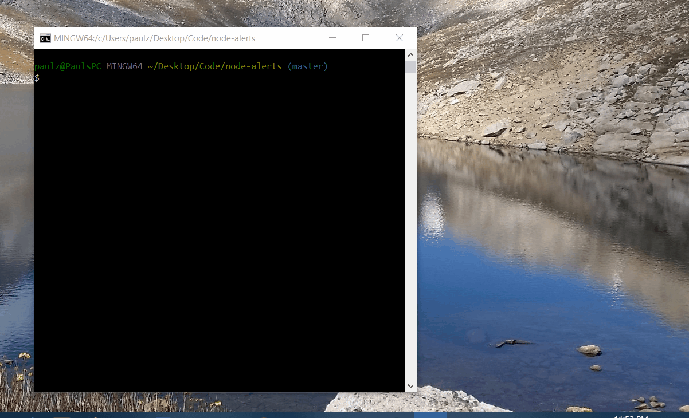

# Pokemon Alerts

POC Node.js app which calls an API at an interval and displays the data via your computer's system notifications.

Thanks to the devs at [Pokéapi](https://pokeapi.co/) for the API.



## How to use
- Clone this repo to your machine
- Ensure your machine is enabled to receive system notifications
- Ensure you have [Node](https://nodejs.org/en/) installed
- Run ``` npm install ``` in your CLI
- Run ``` node app.js ``` in your CLI